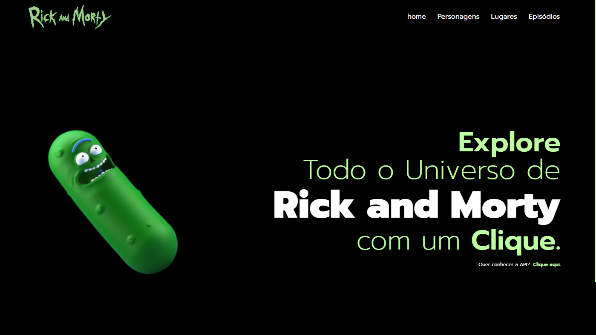

# Rick And Morty Info

> Clique _[aqui](https://www.figma.com/file/3JkhWsPMAB15mkO3sjp485/Site-Rick-and-Morty?type=design&node-id=90-85&t=AuLgw4revgkJMKCs-0)_ para vizualizar o Projeto no Figma
> > Clique _[aqui](https://rickandmortyapi.com)_ para ir para o site da API

## Objetivo

O projeto utilizará Web Components, que são elementos independentes e reutilizáveis da interface do usuárioo. Além disso, o projeto contará com rotas para proporcionar uma navegação intuitiva e fluida na plataforma, permitindo aos usuários moverem-se facilmente entre diferentes seções, como a home, página de personagens, Lugares e Episódios, utilizando a API com o intuito de demonstrar o conhecimento sobre o consumo da mesma adquirido nas aulas anteriores.

## Critérios de avaliação
- [ ]  Documentou problemas, se encontrado, para futuras consultas?
- [x]  Foi criado o layout no figma?
- [x]  A página foi construída seguindo o planejado no Figma?
- [x]  A página funciona em dispositivos diferentes?
- [x]  Foi consumida a API escolhida?
- [x]  Foi criado web componentes?
- [x]  Foi criado um padrão de roteamente para as paginas?
- [x]  As funções foram criadas seguindo à boa prática de responsabilidade única?
- [x]  Quando possível, foi criado funções puras?
- [x]  O projeto está publicado?
- [x]  Foi criado o arquivo README.md?

## Tecnologias e ferramentas Utilizadas

* HTML 
* CSS
* JavaScript
* Netifly

## Autores
* [Daniela](https://github.com/D4kii)

